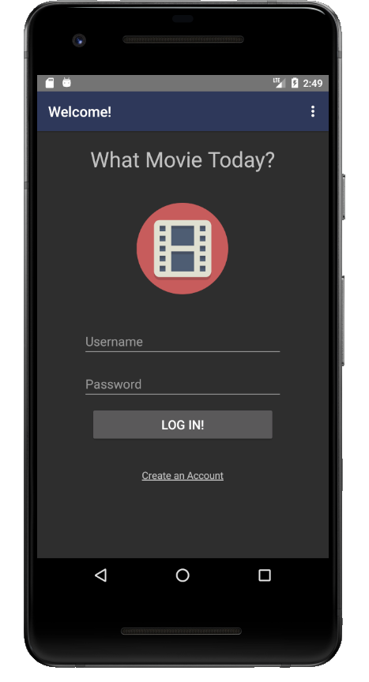
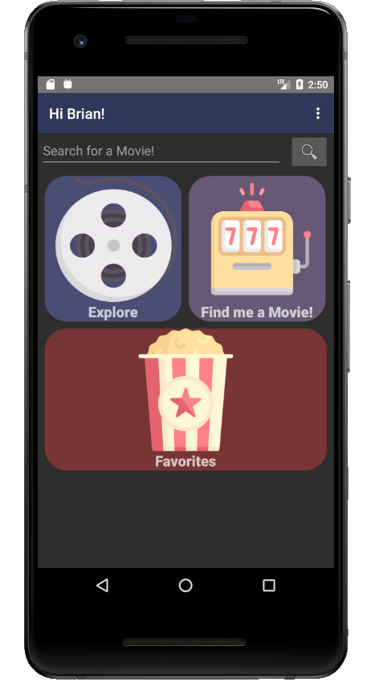
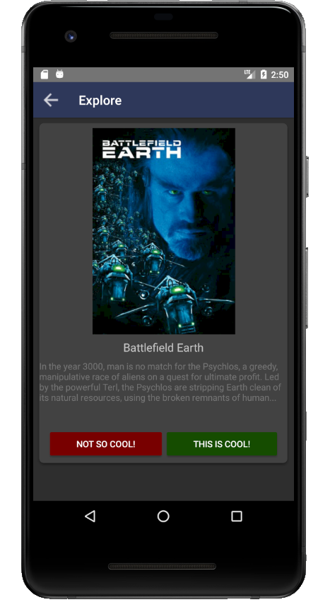

# WhatMovieToday
Because I spend more time looking for movies than watching them. 

Summary
-------------------
In short, this app lets users search and explore different movies to add to their favorites list. Based on these favorites, a movie is then selected for you using the 'Find me a Movie' button.
  
This project was built for Brock University's COSC 3P97 Mobile Computing course. 

Key Features
-------------------
  - Ability to store seperate users (locally using RoomDB api)  
  - Query 'The Movie Database' public API to search for movies
  - Explore movies from a random pool generated by The MovieDB
  - Add movies to a favorites list 
  - Generate a movie to watch based on your selected favorites

Credits 
-------------------
  - Only possible with the help of 'The Movie Database' public API: https://developers.themoviedb.org/3/getting-started/introduction
  - Consult the app/build.gradle file for a list of all API's used 
  

Screenshots 
-------------------

